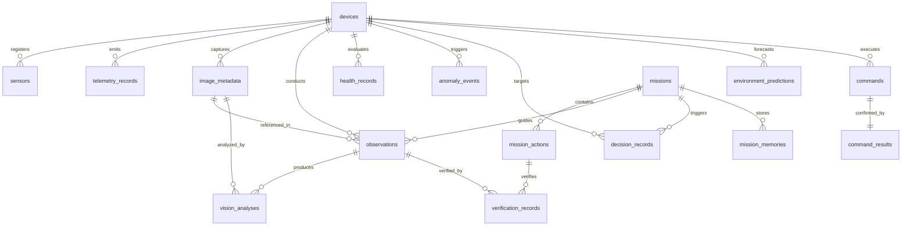

# Solar Sentry — Database Contracts & Architecture Specification

**Agent 3 Authoritative Persistence Layer**

---

## 1. Overview & Architecture Philosophy

The Solar Sentry persistence layer provides normalized, ACID-compliant, high-throughput storage for all telemetry, edge hardware metadata, scientific observations, vision analysis, environment forecasts, health/anomaly events, cognitive decisions, active perception missions, closed-loop verifications, episodic memory, and AI model version registries.

### Core Persistence Principle
> **The database stores authoritative information; it is NOT the decision engine.**
> Business logic, multi-modal reasoning, active perception planning, and edge actuation live in their respective specialized agent modules (Agents 1, 2, and 5–10). The persistence layer provides clean repository query abstractions and transaction management without duplicating domain logic.

---

## 2. Technology & Engine Strategy

- **Dual-Engine Design**:
  - **Production**: PostgreSQL 15+ (with native `JSONB`, connection pooling via `QueuePool`, and index-backed timestamp range scanning).
  - **Development / Edge / Testing**: SQLite 3 with automatic PRAGMA enforcement (`foreign_keys=ON`, `journal_mode=WAL`, `synchronous=NORMAL`).
- **ORM / DDL**: SQLAlchemy 2.0 Modern Declarative Mapped models + Pure SQL DDL migrations.
- **Portability**: Custom TypeDecorators (`PortableJSON` and `UTCDateTime`) guarantee identical behavior across PostgreSQL and SQLite.
- **Connection Management**:
  - `DatabaseConfig`: Environment-variable driven (`SOLAR_SENTRY_DB_URL` / `DATABASE_URL`).
  - FastAPI Dependency: `get_db()` generator.
  - Context Manager: `get_db_session()` for atomic transactions.

---

## 3. Schema & Normalized Table Catalog

The schema comprises **17 normalized tables** covering all 21 system domains:



### Table Summary

| Table Name | Primary Key | Description | Key Indexes |
|---|---|---|---|
| `devices` | `device_id` (VARCHAR) | Controller & camera hardware registry | `status`, `device_type`, `last_seen_at` |
| `sensors` | `sensor_id` (VARCHAR) | Attached physical/virtual sensors | `device_id`, `(device_id, sensor_type)` |
| `telemetry_records` | `id` (BIGINT AUTOINCREMENT) | High-volume time-series readings | `(device_id, timestamp)`, `(timestamp, state)`, `rain_detected` |
| `image_metadata` | `image_id` (VARCHAR) | Captured solar disk optical frames | `(device_id, timestamp)` |
| `observations` | `observation_id` (VARCHAR) | Scientific pointing sessions | `(device_id, timestamp)`, `mission_id`, `status`, `quality_score` |
| `vision_analyses` | `analysis_id` (VARCHAR) | Solar disk & sunspot inferences | `image_id`, `observation_id`, `analyzed_at`, `sunspot_count` |
| `environment_predictions`| `prediction_id` (VARCHAR) | 15/30/60 min quality forecasts | `(target_timestamp, horizon_minutes)`, `(device_id, generated_at)`, `risk` |
| `health_records` | `health_id` (VARCHAR) | Subsystem health diagnoses | `(device_id, timestamp)`, `overall_health_score` |
| `anomaly_events` | `anomaly_id` (VARCHAR) | Sensor fusion & AI anomalies | `(device_id, timestamp)`, `(severity, score)`, `is_resolved` |
| `decision_records` | `decision_id` (VARCHAR) | Cognitive decisions & XAI traces | `(device_id, timestamp)`, `action_proposed`, `(risk, mode)` |
| `missions` | `mission_id` (VARCHAR) | Active perception campaigns | `(state, created_at)`, `priority`, `mission_type` |
| `mission_actions` | `action_id` (VARCHAR) | Sequential mission steps | `(mission_id, sequence_order)`, `status` |
| `mission_memories` | `memory_id` (VARCHAR) | Episodic and continual memory | `(context_tag, timestamp)`, `relevance_score` |
| `commands` | `command_id` (VARCHAR) | Dispatched edge control verbs | `(device_id, dispatched_at)`, `command` |
| `command_results` | `id` (BIGINT AUTOINCREMENT) | Hardware execution confirmations | `command_id` (UNIQUE), `(current_state, status)`, `executed_at` |
| `verification_records` | `verification_id` (VARCHAR) | Post-action closed-loop checks | `action_id`, `observation_id`, `(status, timestamp)` |
| `model_versions` | `model_id` (VARCHAR) | AI/Vision model registry | `(subsystem, is_active)`, `(name, version)` UNIQUE |

---

## 4. Contract Alignment Matrix

| External Contract | Database Entity | Normalized Columns / Mappings |
|---|---|---|
| `SensorTelemetry.json` | `telemetry_records` | `device_id`, `timestamp`, `temperature`, `humidity`, `pressure`, `lux`, `rain_raw`, `rain_detected`, `pan`, `tilt`, `state`, `health`, `wifi_rssi`, `camera_online`, `camera_ip`, `sensor_status_json`, `firmware_version` |
| `Command.json` | `commands` | `command_id`, `device_id`, `command`, `pan`, `tilt`, `speed`, `target_state`, `dispatched_at`, `source` |
| `CommandResult.json` | `command_results` | `command_id`, `status`, `message`, `current_pan`, `current_tilt`, `current_state`, `executed_at` |
| `CognitiveDecision.json` | `decision_records` | `decision_id`, `device_id`, `action_proposed`, `confidence`, `risk`, `mode`, `fused_utility`, `total_uncertainty`, `reasoning_trace`, `inputs_summary_json` |
| `MissionPlan.json` | `missions` & `mission_actions` | `mission_id`, `name`, `mission_type`, `objective`, `priority`, `state`, `target_coordinates_json`, `parameters_json`; discrete action sequence with `sequence_order`, `action_type`, `target_pan`, `target_tilt`, `status` |
| `MissionResult.json` | `missions`, `command_results`, `verification_records` | Execution status, timestamps, linked command history, and `verification_records` with `quality_before`, `quality_after`, `delta_quality`, `converged` |
| `ObservationQualityPrediction.json` | `environment_predictions` | `prediction_id`, `device_id`, `target_timestamp`, `horizon_minutes` (15, 30, 60), `predicted_quality_score`, `predicted_cloud_cover_pct`, `confidence`, `risk`, `model_version` |
| `ObservatoryHealthReport.json` | `health_records` & `anomaly_events` | Subsystem statuses, composite scores, active anomalies (`source_subsystem`, `anomaly_type`, `severity`, `score`, `details_json`, `is_resolved`) |
| `VisionResult.json` | `image_metadata` & `vision_analyses` | Image frames linked to analysis: `solar_disk_detected`, `disk_center_x`, `disk_center_y`, `disk_radius_px`, `sunspot_count`, `limb_darkening_score`, `cloud_obstruction_pct`, `flare_candidate`, `confidence_score`, `features_json` |

---

## 5. Repository Interfaces

All repositories inherit from `BaseRepository[T]` providing:
- `get_by_id(id)`
- `create(entity)`
- `update(entity)`
- `delete(entity)`
- `count()`
- `list_all(limit, offset)`

### Domain-Specific Methods

1. **`TelemetryRepository`**:
   - `record_telemetry(...) -> TelemetryRecord`
   - `record_batch(records: List[dict]) -> int`
   - `get_latest(device_id: str) -> Optional[TelemetryRecord]`
   - `get_range(device_id, start_time, end_time, limit, order_asc) -> List[TelemetryRecord]`
   - `get_by_state(device_id, state, limit) -> List[TelemetryRecord]`
   - `get_rain_events(device_id, limit) -> List[TelemetryRecord]`
   - `get_aggregate_summary(device_id, start_time, end_time) -> dict` (min/max/avg metrics)
2. **`DeviceRepository` & `SensorRepository`**:
   - `register_or_update(...) -> Device`
   - `update_last_seen(device_id, timestamp)`
   - `update_status(device_id, status)`
   - `get_with_sensors(device_id) -> Optional[Device]`
   - `list_by_status(status)`
3. **`ObservationRepository` & `ImageRepository`**:
   - `create_observation(...) -> Observation`
   - `complete_observation(observation_id, quality_score, notes)`
   - `list_by_mission(mission_id) -> List[Observation]`
   - `record_image(...) -> ImageMetadata`
   - `get_latest(device_id) -> Optional[ImageMetadata]`
4. **`VisionAnalysisRepository`**:
   - `record_analysis(...) -> VisionAnalysis`
   - `get_by_image_id(image_id) -> List[VisionAnalysis]`
   - `list_sunspot_detections(min_sunspots, limit) -> List[VisionAnalysis]`
5. **`EnvironmentPredictionRepository`**:
   - `record_prediction(...) -> EnvironmentPrediction`
   - `get_latest_forecast(device_id, horizon_minutes) -> Optional[EnvironmentPrediction]`
   - `list_for_target_window(device_id, start, end) -> List[EnvironmentPrediction]`
6. **`HealthRepository` & `AnomalyRepository`**:
   - `record_health(...) -> HealthRecord`
   - `record_anomaly(...) -> AnomalyEvent`
   - `resolve_anomaly(anomaly_id, notes) -> Optional[AnomalyEvent]`
   - `list_unresolved(device_id) -> List[AnomalyEvent]`
   - `list_by_severity(severity) -> List[AnomalyEvent]`
7. **`DecisionRepository`**:
   - `record_decision(...) -> DecisionRecord`
   - `get_latest(device_id) -> Optional[DecisionRecord]`
   - `list_by_mission(mission_id) -> List[DecisionRecord]`
8. **`MissionRepository`, `MissionActionRepository`, `MissionMemoryRepository`**:
   - `create_mission(...) -> Mission`
   - `update_state(mission_id, state) -> Optional[Mission]`
   - `get_with_actions(mission_id) -> Optional[Mission]`
   - `add_action(...) -> MissionAction`
   - `update_action_status(action_id, status, result_json)`
   - `get_next_pending_action(mission_id) -> Optional[MissionAction]`
   - `store_memory(...) -> MissionMemory`
   - `search_by_tag(context_tag) -> List[MissionMemory]`
9. **`CommandRepository`**:
   - `record_command(...) -> CommandRecord`
   - `record_result(...) -> CommandResultRecord`
   - `get_with_result(command_id) -> Optional[CommandRecord]`
   - `list_unconfirmed(device_id) -> List[CommandRecord]`
10. **`VerificationRepository`**:
    - `record_verification(...) -> VerificationRecord`
    - `get_by_action(action_id) -> List[VerificationRecord]`
    - `get_by_observation(observation_id) -> List[VerificationRecord]`
11. **`ModelVersionRepository`**:
    - `register_model(...) -> ModelVersion`
    - `get_active_model(subsystem, name) -> Optional[ModelVersion]`
    - `set_active_version(model_id) -> Optional[ModelVersion]` (atomically deactivates peer versions)

---

## 6. Migration Procedure

Deterministic SQL migrations are executed through `backend.database.migrations.runner`:
```bash
# Run pending migrations via CLI
python -m backend.database.migrations.runner
```
Or programmatically:
```python
from backend.database.migrations import apply_migrations, get_migration_status

applied = apply_migrations()
print(f"Applied migrations: {applied}")
```
Migrations are tracked in the `schema_migrations` table with SHA-256 checksum validation and execution timestamps.
